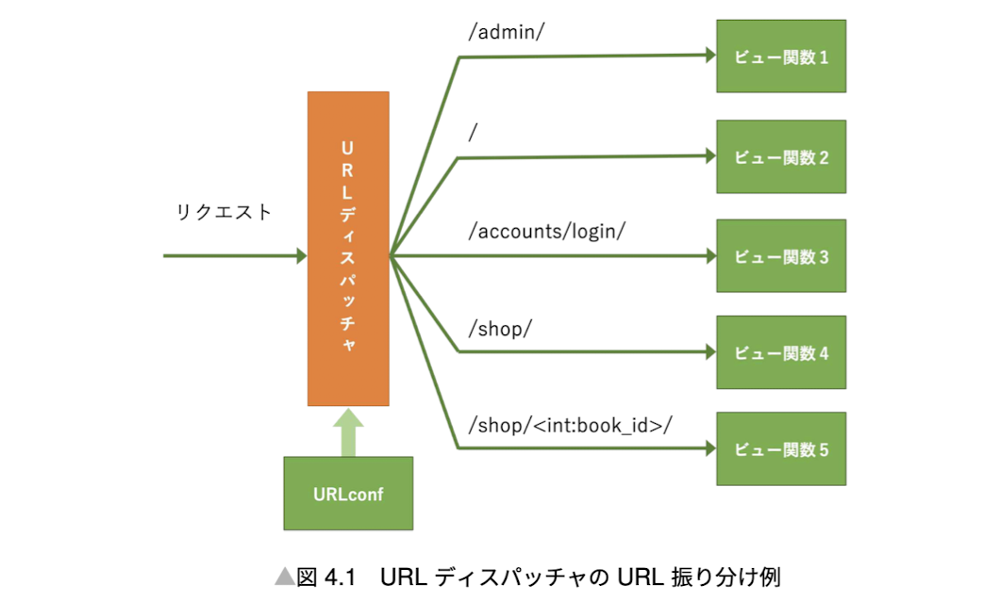

## URL dispatcher



config/urls.py

```python
ROOT_URLCONF = 'config.urls'
```

There are two ways to write urlpattern in config/urls.py.

1. Write urlpattern by path function.

```python
from django.urls import path
from myapp import views
urlpatterns = [
    path('', views.index, name='index'),
]
```

2. Write urlpattern by regular expression.

```python
from django.urls import re_path
from myapp import views
urlpatterns = [
    re_path(r'^$', views.index, name='index'),
]
```

### Best Practices

1. Create urls.py file inside the each app folder.

config/urls.py

```python
from django.urls import path, include
from . import views
urlpatterns = [
    path('', views.index, name='index'),
    path('accounts/', include('accounts.urls')),
    path('shop/', include('shop.urls')),
]
```

accounts/urls.py

```python
from django.urls import path
from . import views
app_name = 'accounts'
urlpatterns = [
    path('signup/', views.signup, name='signup'),
    path('login/', views.login, name='login'),
    path('logout/', views.logout, name='logout'),
]
```

"app_name" is used to distinguish the same name of urlpattern between apps.
