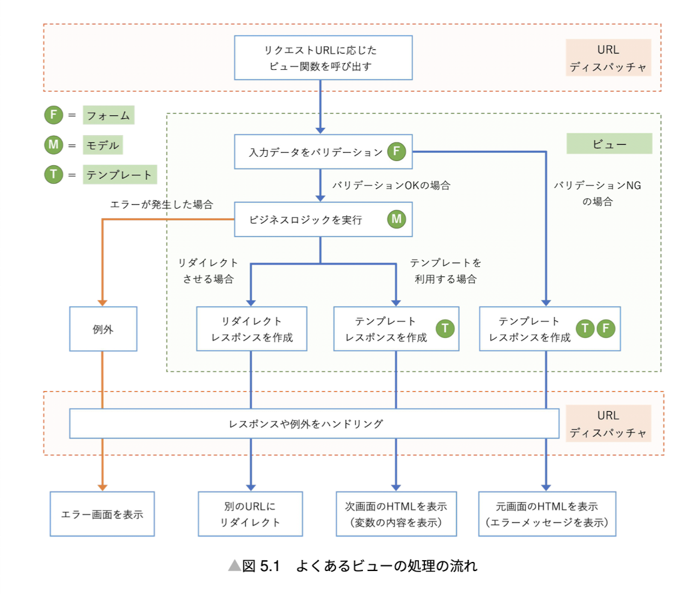

## View



There are two ways to write view function.

1. Function based view

```python
from django.template.response import TemplateResponse

def index(request):
  if request.method == 'GET':
    context = {
      'message': 'Hello, World!'
    }
    return TemplateResponse(request, 'index.html', context)
```

2. Class based view

```python
from django.template.response import TemplateResponse
from django.views import View

class IndexView(View):
  def get(self, request, *args, **kwargs):
    context = {
      'message': 'Hello, World!'
    }
    return TemplateResponse(request, 'index.html', context)

index = IndexView.as_view()
```

There are a lot of class based views in Django. For example, `TemplateView` is a class based view that renders a template. We can override methods and attributes of `TemplateView` to customize it.

```python
from django.views.generic import TemplateView

class IndexView(TemplateView):
  template_name = 'index.html'

  def get_context_data(self, **kwargs):
    context = super().get_context_data(**kwargs)
    context['message'] = 'Hello, World!'
    return context

index = IndexView.as_view()
```

"Classy Class-Based Views" is a good reference for class based views.
https://ccbv.co.uk/
