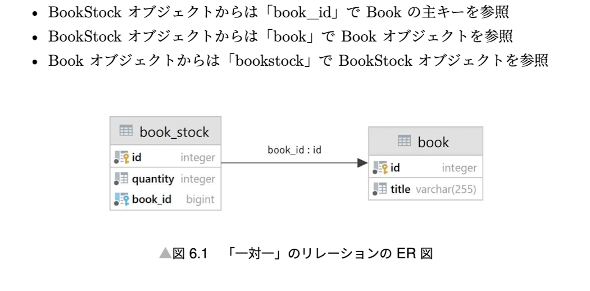

## Model

Django provides an ORM (Object Relational Mapper) to access database. We can define models as Python classes. Django automatically creates tables in database from models.

```python
from django.db import models

class Book(models.Model):
  class Meta:
    db_table = 'book'

  title = models.CharField(max_length=100)
  author = models.CharField(max_length=100)
  publisher = models.CharField(max_length=100)
  price = models.IntegerField()

  def __str__(self):
    return self.title
```

### Relationships

1. One-to-one
   Use "OneToOneField" to define one-to-one relationship.
2. One-to-many
   Use "ForeignKey" to define one-to-many relationship.
3. Many-to-many
   Use "ManyToManyField" to define many-to-many relationship.



### Query

Model has "model manager" (objects) to access database. "model manager" is an interface for QuerySet. QuerySet is a list of model instances.

QuerySet has delay evaluation. It means that QuerySet is not executed until it is evaluated.
For example, "all()", "filter()" methods return QuerySet. QuerySet is evaluated and executed when we use it - refer official document for more details.

### Best Practice

1. Check the query that is executed by Django ORM. It is useful to optimize query.

   1. print query in Django shell
      ```python
      print(Book.objects.all().query)
      ```
   2. use django-debug-toolbar

   3. use Logging

2. Use "select_related" and "prefetch_related" to reduce the number of queries.

   1. select_related

      ```python
      Book.objects.select_related('publisher').all()
      ```

      selecte_related is used for one-to-one and many-to-one relationships. It reduces the number of queries by using "JOIN" in SQL.

   2. prefetch_related
      ```python
      Book.objects.prefetch_related('authors').all()
      ```
      prefetch_related is used for many-to-many and many-to-one relationships. It reduces the number of queries by using "JOIN" in SQL.
