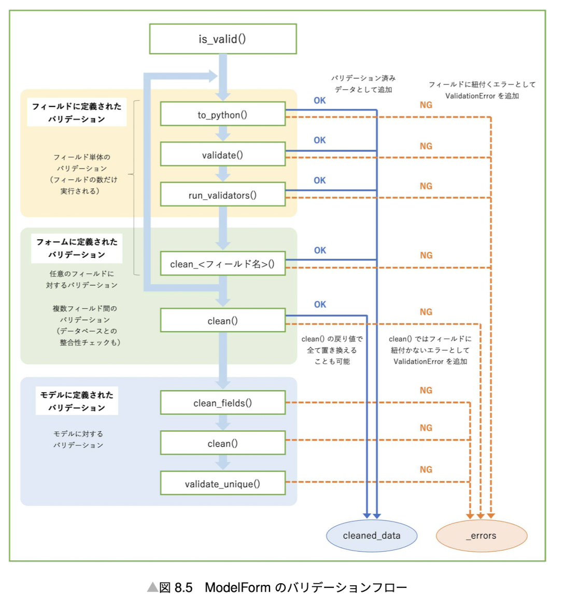

## Form


Validation of form input.

```python
from django import forms

class LoginForm(forms.Form):
  username = forms.CharField(
    label='Username',
    max_length=255,
  )
  password = forms.CharField(
    label='Password',
    max_length=255,
    widget=forms.PasswordInput(),
  )

  def clean_username(self):
    username = self.cleaned_data.get('username')
    if username == 'admin':
      raise forms.ValidationError('Invalid username')
    return username

  def clean(self):
    username = self.cleaned_data.get('username')
    password = self.cleaned_data.get('password')
    try:
      user = User.objects.get(username=username)
      if not user.check_password(password):
        raise forms.ValidationError('Invalid password')
    except User.DoesNotExist:
      raise forms.ValidationError('Invalid username and password')
  # In production case, we should not give the user information about the credential error.
```

### Best Practice

ModelForm is a shortcut to create a form from a model.

```python
from django import forms
from django.contrib.auth import get_user_model

User = get_user_model()

class RegisterForm(forms.ModelForm):
  class Meta:
    model = User
    fields = ['username', 'email', 'password']
    widgets = {
      'password': forms.PasswordInput(attrs={'placeholder': 'Password'}),
    }
    password2 = forms.CharField(
      label='Confirm password',
      required=True,
      max_length=255,
      widget=forms.PasswordInput(attrs={'placeholder': 'Confirm password'}),
    )
    def __init__(self, *args, **kwargs):
      super().__init__(*args, **kwargs)
      self.fields['username'].widget.attrs.update({'placeholder': 'Username'})
      self.fields['email'].required = True
      self.fields['email'].widget.attrs.update({'placeholder': 'Email'})
```


