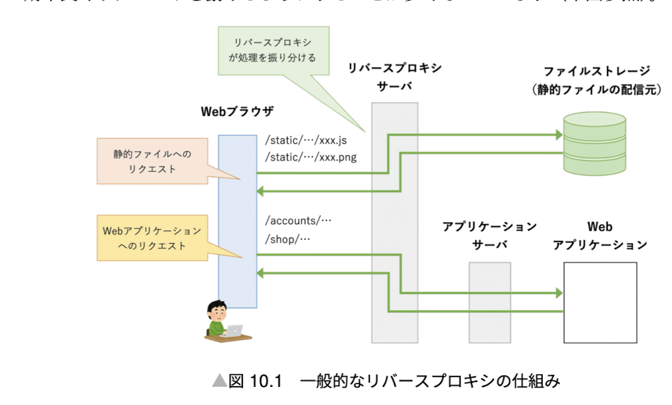

## Settings

Write project specific settings in settings.py and refer "django.conf.settings" in other files.

1. INSTALLED_APPS
   Write the name of the app in INSTALLED_APPS in settings.py. There are default apps and third party apps. We can also write our own apps.
2. Debug
   Debug is a boolean value. If it is True, it will show the error page.
   ```python
   DEBUG = True
   ```
3. Static files
   
   Static files are files that are not changed by the user. For example, css, js, images, etc. are static files. Django does not serve static files in production. We need to use a web server like Nginx to serve static files. In development, Django can serve static files. We need to set STATIC_URL and STATIC_ROOT in settings.py.

```python
STATIC_URL = '/static/'
STATICFILES_DIRS = [BASE_DIR / 'static'],
STATIC_ROOT = f'/var/www/{BASE_DIR.name}/static'
```

If debug is True, Django will serve static files by command runserver. The url will be [http://127.0.0.1:8000/<STAIC_URL>/...].

When use static files in templates, we need to load static files first.

```html



```

4. Media files
   Media files are files that are uploaded by the user. We need to set MEDIA_URL and MEDIA_ROOT in settings.py.

```python
MEDIA_URL = '/media/'
MEDIA_ROOT = f'/var/www/{BASE_DIR.name}/media'
```

5. Logging
   Django has a logging system. We can set the logging level in settings.py. The default logging level is INFO. If we want to log the DEBUG level, we need to set DEBUG=True in settings.py.

config/settings.py

```python
LOGGING = {
  'version': 1,
  'disable_existing_loggers': False,
  'formatters': {
    # production
    'production': {
      'format': '%(asctime) <{process:d}, {thread:d}> [{levelname}]' '{pathname}:{lineno:d} {message}',
      'style': '{',
    },
  },
  'handlers': {
    'file' : {
      'level': 'DEBUG',
      'class': 'logging.FileHandler',
      'filename': f'/var/log/{BASE_DIR.name}/debug.log',
      'formatter': 'production',
    },
  },
  'root': {
    'handlers': ['file'],
    'level': 'DEBUG',
  },
  'loggers': {
    'django': {
      'handlers': ['file'],
      'level': 'DEBUG',
      'propagate': False,
    },
  },
}
```

6. Others
1. Language
   We can set the language in settings.py.
   ```python
   LANGUAGE_CODE = 'ja'
   ```
1. Timezone
   We can set the timezone in settings.py.
   ```python
   TIME_ZONE = 'Asia/Tokyo'
   USE_TZ = True
   ```

### Best Practice

1. local_settings.py
   "local_settings.py" is the best practice to write the settings that are different in development and production. We can import local_settings.py in settings.py.

config/local_settings.py

```python
from .settings import *
DEBUG = True
ALLOWED_HOSTS = ['*']
DATABASES = {
  'default': {
    'ENGINE': 'django.db.backends.sqlite3',
    'NAME': BASE_DIR /'db.sqlite3',
}}
```

```bash
$python3 manage.py runserver --settings config.local_settings
```

2. settings.py for each environment
   We can write settings.py for each environment. For example, we can write settings.py for development and production.
   ```bash
   |-- config
    |   |-- settings
    |   |   |-- __init__.py
    |   |   |-- base.py
            |-- local.py
            |-- production.py
            |-- test.py
   ```
