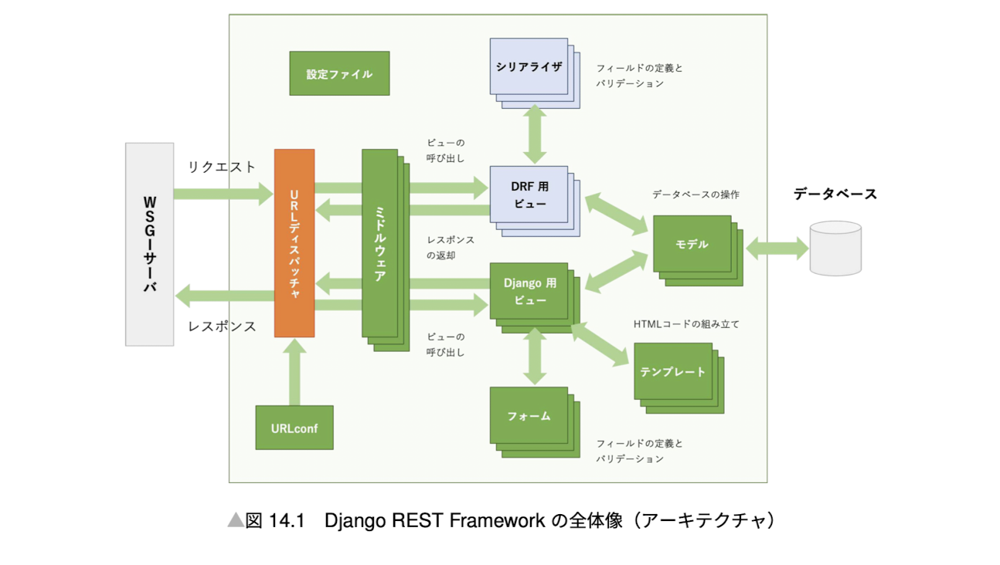

## Package

### DRF

Django Rest Framework (DRF) is a package for building RESTful APIs with Django. We can install DRF with pip.



### django-debug-toolbar

django debug toolbar is a package for debugging Django and show SQL query. We can install django-debug-toolbar with pip.

```bash
pip install django-debug-toolbar
```

config/settings.py (or settings/local_settings.py) at the end of the code.

```python
if DEBUG:
    INSTALLED_APPS += [
        'debug_toolbar',
    ]
    MIDDLEWARE += [
        'debug_toolbar.middleware.DebugToolbarMiddleware',
    ]
    DEBUG_TOOLBAR_CONFIG = {
        'SHOW_TOOLBAR_CALLBACK': show_toolbar,
    }
```

config/urls.py

```python
from django.conf import settings
if settings.DEBUG:
    import debug_toolbar
    urlpatterns += [
        path('__debug__/', include(debug_toolbar.urls)),
    ]
```
